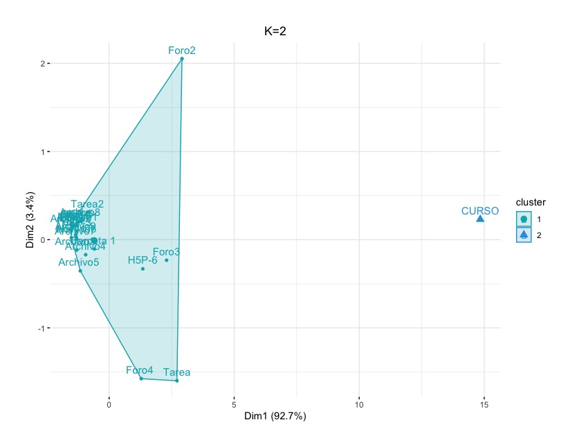
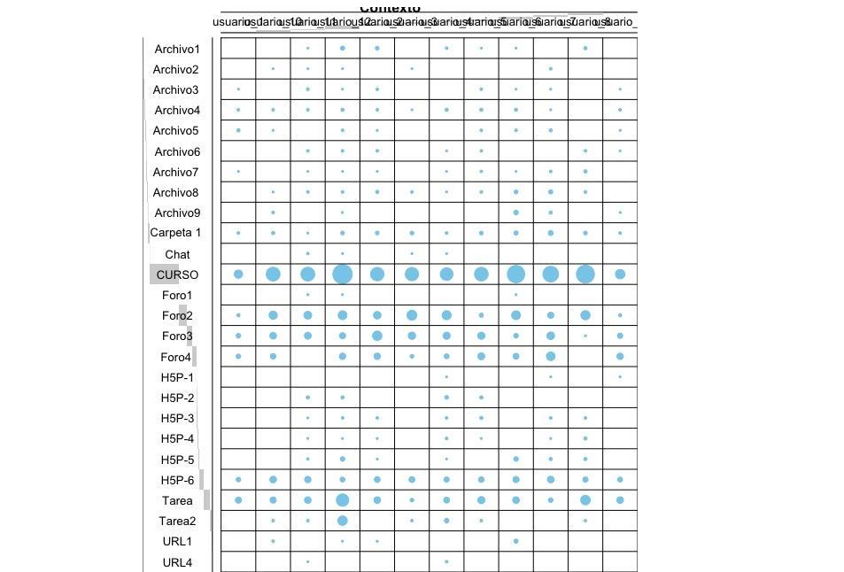
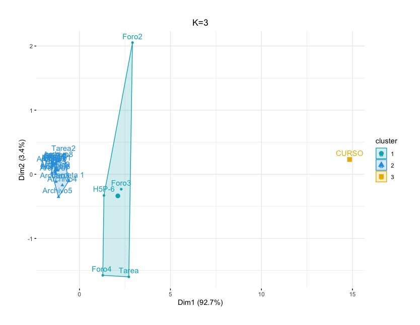
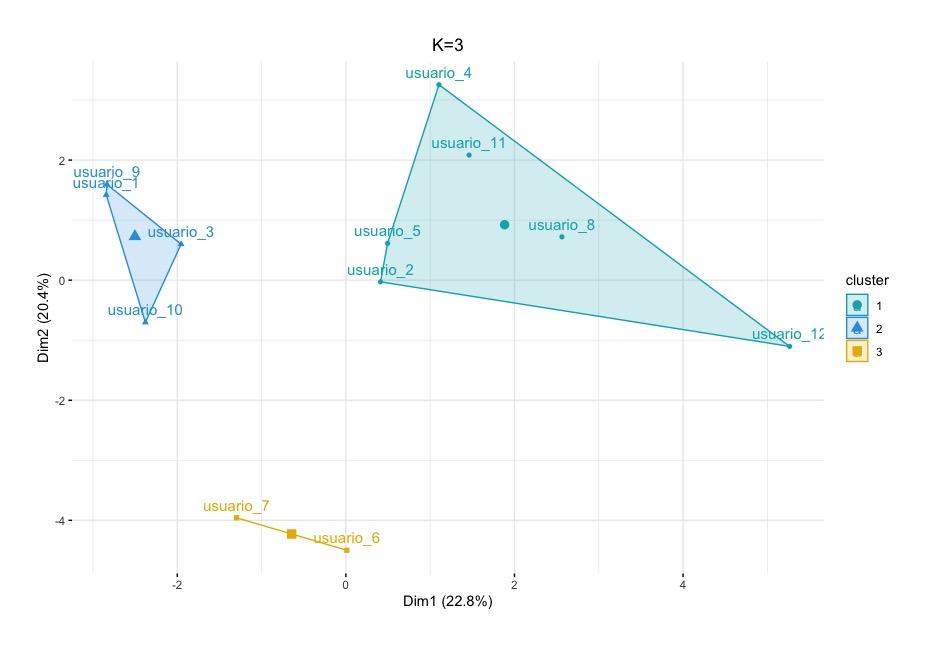

# Learning Analytics con R studio 
Este es la documentación del proceso de limpieza y visualización de un conjunto de datos extraídos de Moodle. El conjunto de datos fue obtenido en un lapso de 7 meses de las cuales existen fechas en que no se registraron ingresos al curso. Este conjunto de datos no presenta valores N/A. Los datos presentan datos de fecha, variables cualitativas (categorías) y númericas de Direción IP.

## Procedimiento
* [Comprensión del dominio de la aplicación](#comprensión-del-dominio-de-la-aplicación)
* [Creación del conjunto de datos](#Creación-del-conjunto-de-datos)
* [Limpieza y Pre procesamiento](#limpieza-y-pre-procesamiento)
* [Reducción de datos](#reducción-de-datos)
* [Tarea de minería de datos](#tarea-de-minería-de-datos)
* [Algoritmo de minería de datos](#algoritmo-de-minería-de-datos)
* [Minería de datos](#minería-de-datos)
* [Interpretación de patrones](#interpretación-de-patrones)
* [Consolidación del conocimiento](#consolidación-del-conocimiento)
* [## Referencias](#referencias)

## Comprensión del dominio de la aplicación
El conjunto de datos utilizado contiene un total de 3240 observaciones y 8 variables. Estos corresponden a los registros almacenados por la plataforma Moodle de un curso conformado por 12 estudiantes, el administrador de la plataforma, un profesor y un investigador. El curso pertenece a una universidad del sur de Chile de una carrera de pregrado y fueron capturados entre los meses de abril y agosto del año 2020 en un contexto de aislamiento social y por lo tanto, en una modalidad de clases a distancia con el uso de Learning Managment System (LMS). Se busca identificar grupos relevantes que describan comportamientos de uso de la plataforma institucional como evidencias de las experiencias de aprendizaje en línea de los estudiantes.

### Variables registradas
* Fecha
* Nombre.del.usuario.completo
* Contexto.del.evento
* Componente
* Nombre.evento
* Descripción
* Origen
* Dirección.IP

## Creación del conjunto de datos
La creación del conjunto de datos fue realizada mediante la descarga directa de la plataforma institucional basada en Moodle. Desde su interfaz predeterminada se filtró el curso del periodo antes mencionado y se generó un archivo en formato Comma Separated Values `.csv`. El archivo `log_p.csv` fue pre-procesado en Microsoft Excel y fue exportado en .csv con codificación UTF-8.

## Limpieza y Pre procesamiento 
Para la limpieza y pre procesamiento de los datos se llevaron a cabo las siguientes acciones.
* Combinación de las variables de "Nombre.de.usuario.completo" y "Usuario.afectado"
* La variable "Contexto.del.evento" fue modificado para reducir la extensión de los nombres de cada categoría y se encuentra en el archivo readme/Contexto_del_evento.txt 
* Conversión de la variable "Hora" a formato fecha
* Anonimizado de los participantes
* Codificación de la variable Componentes

## Reducción de datos
Los datos fueron importados a RStudio desde el archivo [log_p.csv](https://github.com/sergiogonzalezdgp/tesis/log_p.csv) , tomando la primera fila como nombres de columna, usando una "," como separador y especificando codificación UTF-8 y fue almacenado en el objeto `dscompleto`. 

### Transformación de los datos
Se utilizaron las siguientes librerías para la transformación de los datos.
```
library(tidyverse)
library(dplyr)
library(lubridate)
```
### Separación del conjunto de datos
Posteriormente se creó un objeto que excluye las variables de "Dirección.IP", "Origen" y "Descripción" y fue almacenado en el objeto `log`. La columna hora fue transformado a formato fecha.
```
log <- dscompleto
log <- rename(log, Fecha = Hora)
log <- select(log, -Descripción, -Origen, -Dirección.IP)
log <-  filter(log, Contexto.del.evento != "189.148.203.31") 
log <- filter(log, Nombre.completo.del.usuario != "-")
log$Fecha <- as.Date(log$Fecha, format="%Y-%m-%d")

head(log)

       Fecha Nombre.completo.del.usuario Contexto.del.evento              Componente                Nombre.evento
1 2020-09-25                       Admin               CURSO               Registros   Informe de registros visto
2 2020-09-25                       Admin               CURSO                 Sistema                  Curso visto
3 2020-09-25                Investigador               CURSO                 Sistema                  Curso visto
4 2020-09-23                  usuario_11               CURSO                 Sistema                  Curso visto
5 2020-09-22                Investigador               CURSO             Archivo XML   Calificación XML exportada
6 2020-09-22                Investigador               CURSO Informe del Calificador Informe del examinador visto
```
También, se excluyeron aquellos registros realizados por el administrador, investigador y profesor de la asignatura para crear un segundo objeto llamado `estudiantes`. 
```
estudiantes <- filter(log, Nombre.completo.del.usuario != "Admin" & Nombre.completo.del.usuario != "Investigador" & Nombre.completo.del.usuario != "Profesor") 
estudiantes$Nombre.completo.del.usuario <- as.factor(estudiantes$Nombre.completo.del.usuario ) 
estudiantes$Contexto.del.evento <- as.factor(estudiantes$Contexto.del.evento) 
estudiantes$Componente <- as.factor(estudiantes$Componente)
estudiantes$Nombre.evento <- as.factor(estudiantes$Nombre.evento)
```
### Tablas de frecuencia
Se generaron dos objetos para el conteo total de registros `interacciones_cnt` y el conteo total de los estudiantes `usuarios_cnt`. Ambos fueron transformados a tablas de frecuencia a partir de las fechas en que se generaron los registros en plataforma.
```
#Recuento de interacciones totales
interacciones_cnt <- table(unlist(log$Fecha))
interacciones_cnt <- as.data.frame(interacciones_cnt)
interacciones_cnt <- rename(interacciones_cnt, fecha = Var1, cnt = Freq)
interacciones_cnt$fecha <- as.Date(interacciones_cnt$fecha, format="%Y-%m-%d")

#Recuento de usuarios
usuarios_cnt <- table(unlist(estudiantes$Fecha))
usuarios_cnt <- as.data.frame(usuarios_cnt)
usuarios_cnt$Var1 <- as.character(usuarios_cnt$Var1)
usuarios_cnt <- rename(usuarios_cnt, fecha = Var1, cnt = Freq)
usuarios_cnt$fecha <- as.Date(usuarios_cnt$fecha, format="%Y-%m-%d")
```
### Componentes y Contexto del evento
Para obtener una comparativa de las frecuencias de usuarios totales y estudiantes se combinaron las tablas de frecuencias para crear un nuevo objeto llamado "int_join". Se combinaron hacia la izquierda según la fecha de entrada de los usuarios totales y luego se reemplazaron los valores N/A por 0.
```
int_join <- interacciones_cnt %>% left_join(usuarios_cnt, by = "fecha")
int_join <- rename(int_join, Total = cnt.x)
int_join <- rename(int_join, Participantes = cnt.y)
int_join[is.na(int_join)] <- 0
```
### Tablas de frecuencia
Para poder observar los componentes más utilizados de la plataforma se construye una tabla de contingencia con el recuento de estudiantes que accedieron a los diferentes componentes del sistema y contextos de los eventos.
 
```
UC <- table(estudiantes$Nombre.completo.del.usuario, estudiantes$Componente)
UC

             Archivos enviados Carpeta Chat Cuestionario Foro H5P Recurso Sistema Tarea URL Usuario
  usuario_1                  2       2    0            6   15   0       7      21     8   0       0
  usuario_10                 2       3    0           13   41   0       7      58    10   2       0
  usuario_11                 2       1    2           12   35   5      11      57    12   1       0
  usuario_12                 4       4    1            7   49  10      18     112    64   1       1
  usuario_2                  2       4    0            9   66   4      11      48    10   1       0
  usuario_3                  0       4    1           10   46   0       4      55     6   0       0
  usuario_4                  0       2    1            8   45   8       8      50    16   2       0
  usuario_5                  2       4    0            9   34   5      14      58    14   0       0
  usuario_6                  2       5    0           11   38   6      17      93    10   5       0
  usuario_7                  0       7    0           13   49   7      17      73     6   0       0
  usuario_8                  2       4    0            7   25   8      10      98    26   0       0
  usuario_9                  2       2    0            7   22   1       6      28    10   0       0

UCE <-  table(estudiantes$Nombre.completo.del.usuario, estudiantes$Contexto.del.evento)
UCE

Archivo1 Archivo2  Archivo3  Archivo4 Archivo5  Archivo6 Archivo7  Archivo8  Archivo9 Carpeta 1  Chat CURSO Foro1 Foro2
  usuario_1         0         0         1        2         3        0         1         0        0          2    0    20     0     3
  usuario_10        0         1         0        2         1        0         0         1        2          3    0    56     0    20
  usuario_11        1         1         2        2         0        2         1         2        0          1    2    56     1    18
  usuario_12        5         1         1        3         2        2         1         2        1          4    1   110     1    23
  usuario_2         4         0         2        2         1        2         1         3        0          4    0    53     0    17
  usuario_3         0         1         0        1         0        0         0         2        0          4    1    52     0    29
  usuario_4         2         0         0        3         0        1         1         1        0          2    1    47     0    24
  usuario_5         1         0         2        3         2        2         2         2        0          4    0    55     0     5
  usuario_6         1         0         1        3         2        0         1         4        6          5    0    89     1    23
  usuario_7         0         2         1        1         3        0         2         5        3          7    0    72     0    11
  usuario_8         3         0         0        0         0        2         3         2        0          4    0    95     0    25
  usuario_9         0         0         1        2         1        1         0         0        1          2    0    26     0     3
            
             Foro3 Foro4  H5P-1 H5P-2 H5P-3 H5P-4 H5P-5 H5P-6 Tarea Tarea2 URL1 URL4
  usuario_1      6      6     0     0     0     0     0     6    11      0    0    0
  usuario_10    13      9     0     0     0     0     0    13    11      2    2    0
  usuario_11    14      0     0     3     1     1     2    12    13      2    0    1
  usuario_12    11     12     0     3     2     1     6     7    45     26    1    0
  usuario_2     26     12     0     0     2     1     1    10    13      0    1    0
  usuario_3     16      4     0     0     0     0     0    10     4      2    0    0
  usuario_4     15      7     1     4     2     2     1     8    10      6    0    2
  usuario_5     15     14     0     3     3     1     0     9    15      2    0    0
  usuario_6      6     10     0     0     0     0     6    11    13      0    5    0
  usuario_7     17     22     1     0     2     1     3    13     6      0    0    0
  usuario_8      1      0     0     0     2     3     3     8    27      2    0    0
  usuario_9      8     12     1     0     0     0     0     7    13      0    0    0

```
## Visualización de los datos
Se cargan además la librería `ggplot2` y `ggpubr` para la visualización de datos.
```
library(ggplot)
library(ggpubr)
```
### Graficando el acceso al curso
El primer paso fue obtener una imagen global de los accesos al curso a través del tiempo. Para esto se generaron dos gráficas para comparar el comportamiento general de todos los usuarios (registros completos de plataforma) y los estudiantes. 
```
it_g <- ggplot(interacciones_cnt, aes(fecha, cnt)) + geom_line() + scale_x_date('Mes') +
        ylab("Interacciones") + xlab("") + labs(title="Conteo todos los usuarios") +
        theme(plot.title = element_text(hjust = 0.5))
ut_g <- ggplot(usuarios_cnt, aes(fecha, cnt)) + geom_line() + scale_x_date('Mes')  + 
        ylab("Interacciones") + xlab("") + labs(title="Conteo Estudiantes") +
        theme(plot.title = element_text(hjust = 0.5))
figura1 <- ggarrange(it_g, ut_g, ncol = 2, nrow = 1) + theme(plot.margin = unit(c(1, 1, 1, 1), "cm"))
```


Por otra parte, se realiza el mismo procedimiento para generar otro gráfico, esta vez de barras ajustando un degradado según el mínimo y máximo de registros. También se integran en un mismo plot para su comparación.

```
it_b <- ggplot(interacciones_cnt,aes(fecha, cnt, fill = cnt)) + geom_col() + 
        scale_fill_gradient(low = "yellow", high = "red", na.value = NA) +
        ylab("Usuarios totales") + xlab("")
ut_b <- ggplot(usuarios_cnt,aes(fecha, cnt, fill = cnt)) + geom_col() + 
        scale_fill_gradient(low = "yellow", high = "red", na.value = NA) +
        ylab("Participantes") + xlab("")
figura3 <- ggarrange(it_b, ut_b, ncol = 2, nrow = 1) +
          labs(title = "Interacciones a través del tiempo") +
          theme(plot.title = element_text(hjust = 0.5)) +
          theme(plot.margin = unit(c(1, 1, 1, 1), "cm"))
```


En ambos gráficos se puede observar bajas en la cantidad de registros en los periodos comprendidos entre mayo y junio y otra baja en los meses de agosto. Por otra parte, ambos gráficos muestran un máximo de interacciones en diferentes periodos del año. Con la función `summary()` se reportaron siguientes datos:
```
#Todos los usuarios

fecha                 cnt        
 Min.   :2020-04-05   Min.   :  1.00  
 1st Qu.:2020-05-09   1st Qu.:  4.00  
 Median :2020-06-21   Median : 14.00  
 Mean   :2020-06-21   Mean   : 27.66  
 3rd Qu.:2020-08-03   3rd Qu.: 37.00  
 Max.   :2020-09-25   Max.   :202.00  
```

```
#Estudiantes

fecha                 cnt        
 Min.   :2020-04-13   Min.   :  1.00  
 1st Qu.:2020-05-11   1st Qu.:  3.00  
 Median :2020-06-22   Median :  6.00  
 Mean   :2020-06-20   Mean   : 18.39  
 3rd Qu.:2020-08-02   3rd Qu.: 20.00  
 Max.   :2020-09-23   Max.   :157.00  
```

En los gráficos anteriores aún es complejo comparar ambas frecuencias de acceso a causa de las diferentes escalas. Por lo tanto, se genera un tercer plot en el que se sobreponen ambas gráficas.
```
figura2 <- ggplot(int_join, aes(fecha)) +   
  geom_area(aes(y = Total), color = "blue", alpha=0.5, fill = "blue", linetype = "blank") +
  geom_area(aes(y = Participantes), color = "red", alpha=0.8, fill = "red", linetype = "blank") +
  labs(title = "Comparación de usuarios totales y participantes")+
  theme(plot.title = element_text(hjust = 0.5)) +
  ylab("Interacciones") + xlab("")+
  theme(plot.margin = unit(c(1, 1, 1, 1), "cm"))
figura2 
```
En color azul se encuentra graficado los registros totales mientras que en color rojo se sobreponen los datos de los estudiantes. Uno de los elementos que sobresalen en este gráfico es la cantidad de usuarios que estaban presentes en plataforma durante el último mes de clases, lo que se mantuvo al excluir al administrador, profesor e investigador. También se observa en el resto del gráfico que durante los meses anteriores a agosto, existen más cantidad registros a causa de la administración, el profesor e investigador. Por otra parte, durante el primer mes hay registros sólo de la administración, profesor e investigador.


Para obtener una imagen más detallada de este periodo se extraen los datos entre el 02 de agosto y 02 de septiembre y se almacena en el objeto `ago.sep`. Se reemplazan las fechas faltantes entre estas fechas y se reemplazan por cero y posteriormente se grafica.
```
ago.sep <- filter(usuarios_cnt, usuarios_cnt$fecha >= "2020/08/01" & usuarios_cnt$fecha <= "2020/09/02")
ago.sep <- ago.sep %>% complete(fecha = seq.Date(min(fecha), max(fecha), by="day")) 
ago.sep[is.na(ago.sep)] <- 0
ultimomes <- ggplot(ago.sep, aes(fecha, cnt)) + geom_line() + scale_x_date('Mes') +
  ylab("Interacciones") + xlab("") + labs(title="Último mes de clases") +
  theme(plot.title = element_text(hjust = 0.5))
```


Del total de registros de estudiantes `1748` se calculó la cantidad de usuarios del último mes con la función `sum`.
```
> sum(ago.sep$cnt)
[1] 501
```

### Tabla de frecuencia
Para el análisis de posterior, se generó una tabla de frecuencia a partir de la variable `Contexto.del.evento` y `Nombre.completo.del.usuario` la cual posteriormente fue transformado a una matriz. Además se escalaron los datos para hacer comparables las variablos, procedimiento que consiste en que los datos tengan una media de "0" y una desviación estandar de 1.

```
UCE_escalado = as.data.frame.matrix(scale(UCE)) #Escalar
UCE_escalado
```

## Tarea de minería de datos
Se decide utilizar una tarea de agrupamiento que corresponde a las tareas de tipo descriptiva. La literatura también la describe como un método de análisis multivariante para la representación de relaciones. El agrupamiento tiene como objetivo encontrar grupos o conjuntos de elementos que entre sí sean similares (Hernández et al., 2010). Esto quiere decir que se busca que los elementos que pertenen a un grupo tengan un grado alto de similitud entre sí. En algunos casos se pueden determinar el número de grupos que se desea encontrar y en otros casos esto se puede determinar mediante un algoritmo de agrupamiento según las características de los datos (Hernández et al., 2010).

## Algoritmo de minería de datos

Para determinar la cantidad óptima de clúster existen varios métodos, entre ellos el método del codo, el método de silueta y Gap. En primera instancia, la idea de los métodos de particionamiento como el kmeans, es definir una cantidad de cluster en que la suma total de la variación intra clúster sea minimizada.


<math xmlns="http://www.w3.org/1998/Math/MathML" display="block">
  <mtable displaystyle="true">
    <mlabeledtr>
      <mtd id="mjx-eqn-1">
        <mtext>(1)</mtext>
      </mtd>
      <mtd>
        <mi>m</mi>
        <mi>i</mi>
        <mi>n</mi>
        <mi>i</mi>
        <mi>m</mi>
        <mi>i</mi>
        <mi>z</mi>
        <mi>e</mi>
        <mrow class="MJX-TeXAtom-ORD">
          <mo maxsize="2.470em" minsize="2.470em">(</mo>
        </mrow>
        <munderover>
          <mo>&#x2211;<!-- ∑ --></mo>
          <mrow class="MJX-TeXAtom-ORD">
            <mi>k</mi>
            <mo>=</mo>
            <mn>1</mn>
          </mrow>
          <mi>k</mi>
        </munderover>
        <mi>W</mi>
        <mo stretchy="false">(</mo>
        <msub>
          <mi>C</mi>
          <mi>k</mi>
        </msub>
        <mo stretchy="false">)</mo>
        <mrow class="MJX-TeXAtom-ORD">
          <mo maxsize="2.470em" minsize="2.470em">)</mo>
        </mrow>
      </mtd>
    </mlabeledtr>
  </mtable>
</math>


Con el método del codo, el total de la suma de los cuadrados intra cluster mide lo compacto del cluster, el cual debe ser lo más bajo posible. El metodo de silueta mide la calidad del clustering, determinando qué tan bien se posiciona cada objeto dentro del clúster. El método GAP compara el total de la variación intracluster para diferentes valores de k con los valores esperados bajo una distribución de referencia nula en los datos.

Para determinar la cantidad de cluster se utilizó la  función `fviz_nbclust` del paquete FactoMineR. Esta función permite calcular y graficar los 3 métodos mencionados anteriormente.


El algoritmo utilizado fue el K medias, que es un método de agrupamiento por vecindad, en que los datos con características similares se ubican en el espacio mediante sus centros o prototipos (Hernández et al., 2010). K medias opera directamente en una matriz de datos en busca de similitudes, y necesita un conjunto de posiciones tentativas alrededor de las cuales organizar grupos para el ajuste posterior. 


El algoritmo realiza los siguientes pasos:

* Fijar el número de cluster igual o mayor a 2
* Calcula los centroides de cada cluster
* Asigna sus puntos mas cercanos al centroide
* Recalcula la posición del centroide y repite


## Minería de datos

Se cargó la librería `factoextra` y se ejecutó la función `fviz_nbclust` correspondiente para cada uno de los métodos.


### Cantidad óptima de Cluster para los usuarios
Aunque el método del codo no sugiere claramente un punto de quiebre en la curva,  se podría asumir que desde el cuarto clúster hay un cambio de dirección más claro.
```
set.seed(123)
fviz_nbclust(UCE_escalado, kmeans, method = "wss")
``` 


 
Con respecto al método de silueta nos sugiere claramente que un número de 8 cluster es el ideal.
```
set.seed(123)
fviz_nbclust(UCE_escalado, kmeans, method = "sillhoutte")
```


En el caso del método estadístico Gap, éste indica que estadísticamente el conjunto de datos se puede agrupar de forma óptima en un solo clúster.
```
set.seed(123)
fviz_nbclust(UCE_escalado, kmeans, method = "gap_stat")

```


### Extracción de cluster de usuarios
Debido a que los métodos para determinar la cantidad de clúster óptimos difieren entre sí, se decide graficar la distribución de k=1 hasta k=4. 


* La extracción de K=2 arrojó dos cluster de tamaño 6 y 6 con 20.1% de la suma de los cuadrados internos. 
* La extracción con K=3 arrojó clúster de tamaño 4, 2 y 6 con un 35,7% de la suma de cuadrados internos.
* La extracción con K=4 encontró clúster de tamaño 4, 4, 2 y2 con un 48,1% de la suma de los cuadrados internos.

Con la misma tabla de frecuencias se realizó una segunda extracción de cluster para las actividades y recursos de la plataforma. Para esto, se realizó el mismo procedimiento anterior. En este caso se hizo una rotación de la tabla.

### Cantidad óptima de Cluster para los recursos de plataforma
La tarea de agrupación por vecindad y en este caso el algoritmo kmeans, es muy sensible a los cambios en los datos, por lo que la rotación de la tabla de frecuencias muestra ajustes totalmente diferentes al modelo anterior. El método del codo indica que el número óptimo es de dos clúster.


El método del ancho medio de la silueta también sugiere un corte de dos clúster.


El tercer método sugiere que el número óptimo de cluster es de 1.


### Extraccion de clúster para recursos de la plataforma

En este caso específico dos de los tres métodos sugirieron un número óptimo de 2 cluster, por lo que se realizó la extracción y graficación.

```

cl_UCE_2 <- kmeans(UCE_escalado,2,nstart = 50, iter.max = 15) 
p_UCE_cl2 <- fviz_cluster(cl_UCE_2, data = UCE_escalado,
                      palette = c("#00AFBB","#2E9FDF", "#E7B800"),
                      ggtheme = theme_minimal(),
                      main = "K=2"
) + theme(plot.margin = unit(c(1, 1, 1, 1), "cm")) + theme(plot.title = element_text(hjust = 0.5))

```
Se generaron dos clúster de tamaño 25 y 1 con un 76% de la suma interna de los cuadrados, en que el segundo grupo solo contiene la variable CURSO.


 
Aunque anteriormente los métodos para encontrar la cantidad máxima de clúster sugerían realizar la extracción con solo dos clúster, se realiza otra extracción con K=3. Debido a que la tabla de frecuencias de los recursos muestró que hay un recurso con una gran cantidad de registros (CURSO) y que las variables restantens tienen una frecuencias baja y media, por lo que podría existir una tercera agrupación que explique mejor los datos.



De esta modo, se generó tres grupos de 5, 20 y 1 observación con un 92,9% de la suma interna de los cuadrados. 



## Interpretación de patrones

En el análisis de cluster de estudiantes, se generaron 4 extracciones con K=1, K=2, K=3 y K=4, sin embargo el análisis para identiicar el número óptimo de clúster no fue concluyente. La extracción final con K=3 fue el que agrupó de mejor manera las variables de manera gráfica. 



El modelo final con K=3 indica ser correcto, pero según la prueba Gap el conjunto de datos podría ser agrupado en un sólo cluster. Esto tiene sentido cuando observamos la extensión del conjunto de datos es pequeño y se observa en la tabla de frecuencias que el grupo es homogéneo. La excepción es el estudiante 12 que es el que más interactuó con la plataforma, pero que no se observa en las gráficas hasta el modelo con K=4. Una vez más, esto puede indicar que el valor K=1 para la agrupación por estudiantes es el modelo definitivo y que describe mejor el conjunto.

Por otra parte, para el clúster por recursos de plataforma se pudo evidenciar que el modelo que mejor representó al conjunto de datos resulta con K=3. Esto, respaldado tanto por la prueba del codo como silueta. En este caso específico se manifestaron 3 grupos que evidencian el acceso a recursos del curso por parte de los estudiantes. En el terecer grupo se agrupó la variable "CURSO" que es la que registra mayor cantidad de ocurrencias y que se relacionan directamente con visualizaciones del curso en general y acceso a la plataforma. Por otra parte, el segundo grupo fue se refiere a recursos en que los estudiantes presentaron mayor actividad y que principalmente se pueden identificar al inicio y al final del periodo de clases. Con respecto al primer grupo, este fue definido por todos aquellos recursos que registraron menos visualizaciones y que por lo tanto, tuvieron menos atención por parte de los estudiantes.


## Consolidación del conocimiento
El primer modelo de agrupación de estudiantes no generó resultados satisfactorios, principalmente porque el comportamiento del grupo fue homogéneo. Tal y como se visualizó en las frecuencias de acceso, todos los estudiantes ingresaron a la plataforma y mostrarin una mayor particioación al inicio y al final del periodo de clases. Aún así, se mantuvo una baja frecuencia de acceso, pero estable durante los demás meses en que se desarrolló el curso. Por esta razón, se puede concluir que K=1 representa de mejor manera el comportamiento general del grupo.

El segundo modelo de agrupación de recursos de plataforma, evidenció de manera eficiente cuáles fueron las preferencias de los usuarios durante el periodo de clases. En este caso, se identificaron 3 grupos que describen aquellos recursos de plataforma que fueron más y menos utilizados por los estudiantes. Las visualizaciones generales del curso dominaron los registros de plataforma. El segundo grupo fue el más importante ya que refleja aquellos recursos y tipos de actividades que podrían volver a ser implementadas a futuro. Por otra parte, el primer grupo fue el que menos impactó en la experiencias de aprendizaje de los estudiantes, por lo que se sugiere revisar y re evaluar la implementación de estos recursos a futuro. 

Para los siguientes trabajos se sugiere contar con registros de cursos más grandes o de varios cursos para poder utilizar otras técnicas de minería de datos.

## Referencias
* Datanovia. (2020)K-Means Clustering in R: Algorithm and Practical Examples Datanovia.com https://www.datanovia.com/en/lessons/k-means-clustering-in-r-algorith-and-practical-examples/
* Hernández Orallo, J., Ramírez Quintana, M. J., & Ferri Ramírez, C. (2010). Introducción a la minería de datos. Pearson.
* W.L. Myers and G.P. Patil, Multivariate Methods of Representing Relations 13
in R for Prioritization Purposes, Environmental and Ecological Statistics 6,
DOI 10.1007/978-1-4614-3122-0_2, © Springer Science+Business Media, LLC 2012
